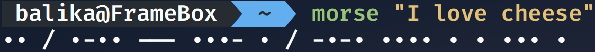

# JavaAZtoMorse
Translates whatever you input to morse code

## Instructions
- Edit the launch script, `morse`, to point to where you cloned the repo (Add to `/usr/bin/` for maximum user experience)
- Launch using `morse` and the text you want to translate as an argument to it surrounded by quotations.

## Example

